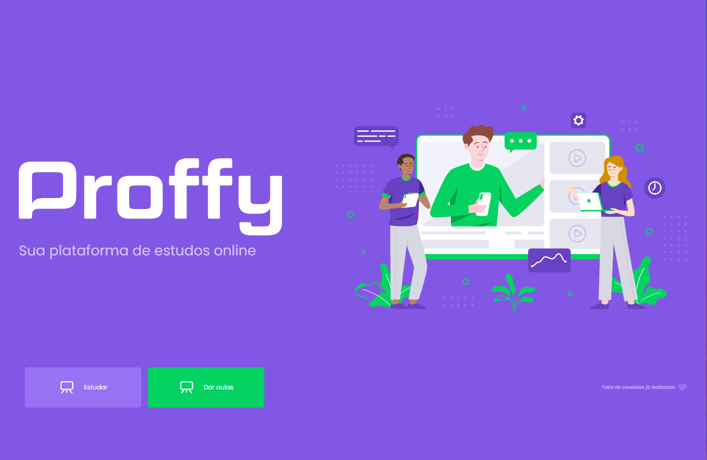

<h4 align="center">
  🚀 NextLevelWeek 2.0
</h4>

 Projeto auxíliado pela Rocketseat.



## Tecnologias

- Node.JS
- Nunjucks
- SqLite-async
- Express

<p align="center">
    
</p>

 Projeto motivado para fixação do aprendizado nas tecnologias citadas anteriormente.

## Instalação de depedências


```bash
yarn add
yarn dev
```

No navegador digite : `localhost:3000`